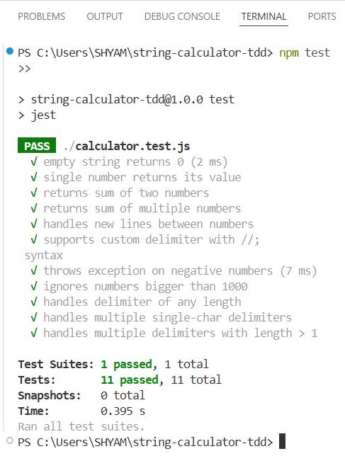

# 🧮 String Calculator - TDD Kata

A simple string calculator built using **Test-Driven Development (TDD)** in JavaScript with **Jest**. Inspired by Roy Osherove’s classic kata.

---

## 📌 Features

- Returns the sum of numbers in a string
- Supports:
  - Empty string → returns `0`
  - Comma-separated numbers → `"1,2"` → `3`
  - Newline (`\n`) as a delimiter → `"1\n2,3"` → `6`
  - Custom delimiters: `"//;\n1;2"` → `3`
  - Delimiters of any length: `"//[***]\n1***2***3"` → `6`
  - Multiple delimiters: `"//[*][%]\n1*2%3"` → `6`
  - Ignores numbers > 1000: `"2,1001"` → `2`
  - Throws error for negative numbers: `"1,-2"` → `Error: negative numbers not allowed -2`

---

## 🧪 TDD Progress

Each feature was implemented via the TDD process:

1. ✅ Wrote a failing test
2. ✅ Made it pass with minimum code
3. ✅ Refactored
4. ✅ Committed changes

---

## ✅ Test Output

Here is a screenshot of all tests passing:

